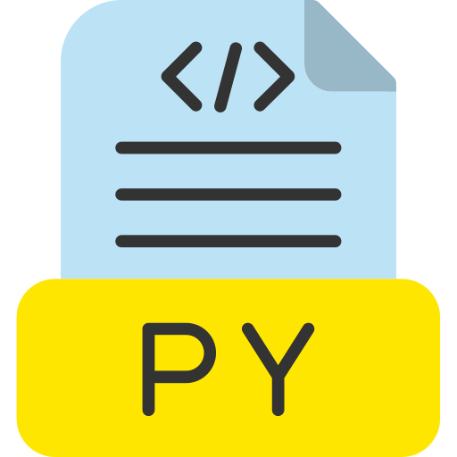
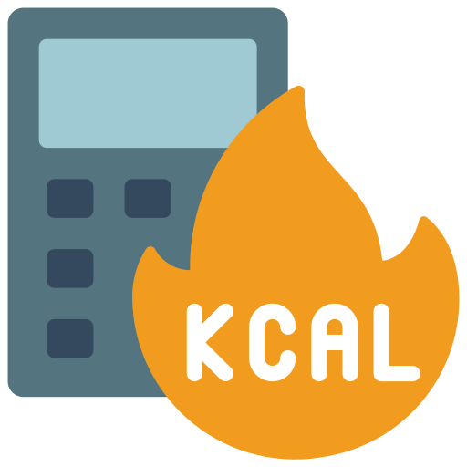
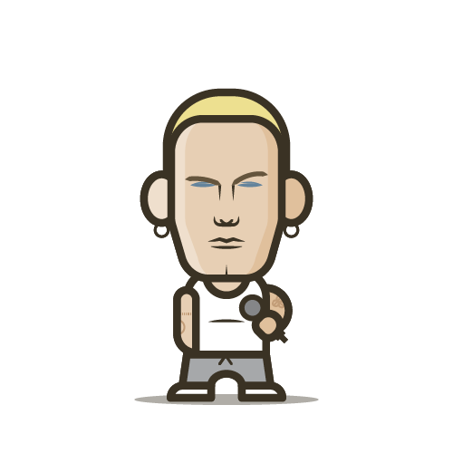

## 📝 **Overview**  
This repository showcases a collection of **featured open-source projects**, developed to solve real-world problems using Python. These projects focus on **automation, web development, scripting, and data-driven applications**, demonstrating practical and scalable solutions for various use cases.  

Each project is designed with **customizability** in mind, allowing developers, businesses, and startups to **adapt and expand upon them** based on their needs. From **intelligent automation** to **AI-powered tools**, these projects offer a strong foundation for building tailored solutions.  

💡 **All projects are open-source, MIT-licensed, and fully customizable.** You can use them as-is or modify them to fit your specific requirements.  

📩 **Need a custom version?** Contact me for tailored solutions.  

---

## 🚀 **Explore Featured Projects**  
Discover a collection of **powerful, open-source projects** designed to automate workflows, enhance productivity, and solve real-world problems. Each project is **MIT-licensed, fully customizable, and ready for integration** into your personal or business applications.  

💡 **Looking to tailor these projects to your needs?** I offer **custom modifications and enhancements** for businesses, developers, and startups.

---

## 🧠 **AI and Machine Learning**  
<table>
    <tr>
        <td align="center">
            <h3>
                <a href="https://github.com/emads22/DocuPy" target="_blank">
                    
                      DocuPy
                </a>
            </h3>
        </td>
        <td align="center">
            <h3>
                <a href="https://github.com/emads22/IntelliByte" target="_blank">
                    
                      IntelliByte
                </a>
            </h3>
        </td>
        <td align="center">
            <h3>
                <a href="https://github.com/emads22/Recommendation-Systems-Explored" target="_blank">
                    
                      Recommender-Systems
                </a>
            </h3>
        </td>
    </tr>
</table>

---

## 💻 **Application Development**  
<table>
    <tr>
        <td align="center">
            <h3>
                <a href="https://github.com/emads22/CaptureX" target="_blank">
                    
                      CaptureX
                </a>
            </h3>
        </td>
        <td align="center">
            <h3>
                <a href="https://github.com/emads22/CensorFace" target="_blank">
                    
                      CensorFace
                </a>
            </h3>
        </td>
        <td align="center">
            <h3>
                <a href="https://github.com/emads22/Hotel-Booking-System" target="_blank">
                    
                      Hotel-Booking-System
                </a>
            </h3>
        </td>
    </tr>
    <tr>
        <td align="center">
            <h3>
                <a href="https://github.com/emads22/MarketMapper" target="_blank">
                    
                      MarketMapper
                </a>
            </h3>
        </td>
        <td align="center">
            <h3>
                <a href="https://github.com/emads22/MotionAlert" target="_blank">
                    
                      MotionAlert
                </a>
            </h3>
        </td>
        <td align="center">
            <h3>
                <a href="https://github.com/emads22/NewsWire" target="_blank">
                    
                      NewsWire
                </a>
            </h3>
        </td>
    </tr>
    <tr>
        <td align="center">
            <h3>
                <a href="https://github.com/emads22/Notebook-Generator" target="_blank">
                    
                      Notebook-Generator
                </a>
            </h3>
        </td>
        <td align="center">
            <h3>
                <a href="https://github.com/emads22/ShapeArt" target="_blank">
                    
                      ShapeArt
                </a>
            </h3>
        </td>
        <td align="center">
            <h3>
                <a href="https://github.com/emads22/Student-Management-System" target="_blank">
                    
                      Student-Management-System
                </a>
            </h3>
        </td>
    </tr>
    <tr>
        <td align="center">
            <h3>
                <a href="https://github.com/emads22/WordWise-Dictionary" target="_blank">
                    
                      WordWise-Dictionary
                </a>
            </h3>
        </td>
    </tr>
</table>

---

## 🌍 **Web Development and API**  
<table>
    <tr>
        <td align="center">
            <h3>
                <a href="https://github.com/emads22/CalorieQuest" target="_blank">
                    
                      CalorieQuest
                </a>
            </h3>
        </td>
        <td align="center">
            <h3>
                <a href="https://github.com/emads22/Cocktail-Compass" target="_blank">
                    
                      Cocktail-Compass
                </a>
            </h3>
        </td>
        <td align="center">
            <h3>
                <a href="https://github.com/emads22/DeliciousBite" target="_blank">
                    
                      DeliciousBite
                </a>
            </h3>
        </td>
    </tr>
    <tr>
        <td align="center">
            <h3>
                <a href="https://github.com/emads22/EchoMood" target="_blank">
                    
                      EchoMood
                </a>
            </h3>
        </td>
        <td align="center">
            <h3>
                <a href="https://github.com/emads22/Flatshare-Splitter-Web" target="_blank">
                    
                      Flatshare-Splitter-Web
                </a>
            </h3>
        </td>
        <td align="center">
            <h3>
                <a href="https://github.com/emads22/Forecast-Finder" target="_blank">
                    
                      Forecast-Finder
                </a>
            </h3>
        </td>
    </tr>
    <tr>
        <td align="center">
            <h3>
                <a href="https://github.com/emads22/FXRate-API" target="_blank">
                    
                      FXRate-API
                </a>
            </h3>
        </td>
        <td align="center">
            <h3>
                <a href="https://github.com/emads22/RetroWeather-API" target="_blank">
                    
                      RetroWeather-API
                </a>
            </h3>
        </td>
        <td align="center">
            <h3>
                <a href="https://github.com/emads22/WordWiz" target="_blank">
                    
                      WordWiz
                </a>
            </h3>
        </td>
    </tr>
    <tr>
        <td align="center">
            <h3>
                <a href="https://github.com/emads22/WordWiz-API" target="_blank">
                    
                      WordWiz-API
                </a>
            </h3>
        </td>
    </tr>
</table>

---

## 🤖 **Automation and Web Scraping**  
<table>
    <tr>
        <td align="center">
            <h3>
                <a href="https://github.com/emads22/EventTune-Tracker" target="_blank">
                    
                      EventTune-Tracker
                </a>
            </h3>
        </td>
        <td align="center">
            <h3>
                <a href="https://github.com/emads22/PricePulse" target="_blank">
                    
                      PricePulse
                </a>
            </h3>
        </td>
    </tr>
</table>

---

## 📊 **Data Analysis and Visualization**  
<table>
    <tr>
        <td align="center">
            <h3>
                <a href="https://github.com/emads22/MoodWave" target="_blank">
                    
                      MoodWave
                </a>
            </h3>
        </td>
        <td align="center">
            <h3>
                <a href="https://github.com/emads22/ToneAnalyzer" target="_blank">
                    
                      ToneAnalyzer
                </a>
            </h3>
        </td>
    </tr>
</table>

---

## 📦 **Packages**      
<table>
    <tr>
        <td align="center">
            <h3>
                <a href="https://github.com/emads22/eminem-lyric-package" target="_blank">
                    
                      eminem-lyric-package
                </a>
            </h3>
        </td>
        <td align="center">
            <h3>
                <a href="https://github.com/emads22/invoice-pdfgen-python" target="_blank">
                    
                      invoice-pdfgen-python
                </a>
            </h3>
        </td>
    </tr>
</table>

---

## 🤝 **Let’s Build Something Together**  
Innovation thrives on collaboration. Whether you’re a **developer looking to contribute, a startup needing a powerful tool, or a business seeking automation solutions**, these projects can be **the foundation of something bigger**.  

💡 **Need a custom-built version? Want to integrate one of these projects into your workflow?** Let’s discuss how I can help you **bring your vision to life**.  

📩 **Email:** [emadsaab222@gmail.com](mailto:emadsaab222@gmail.com)  
💬 **LinkedIn:** [in/emadsaab](https://www.linkedin.com/in/emadsaab/)  
🐙 **GitHub:** [github.com/emads22](https://github.com/emads22)  

🚀 *Let’s innovate and build something amazing together!*  
