# DocuPy: Screenshots 

---

<a href="DocuPy-2.png">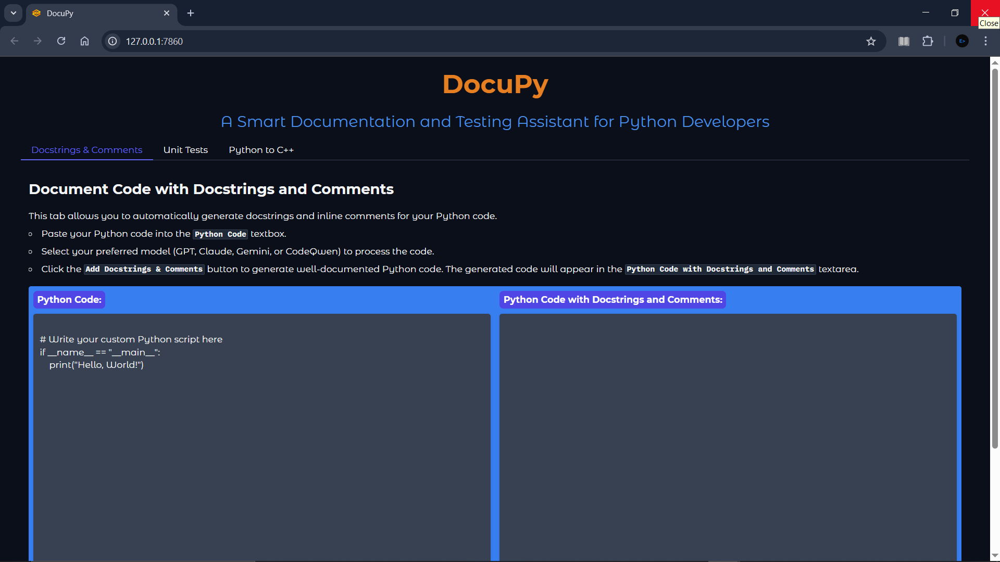</a>
<a href="DocuPy-3.png">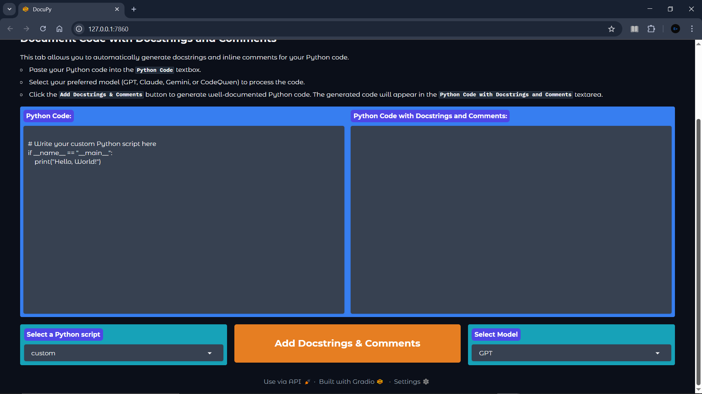</a>
<a href="DocuPy-4.png">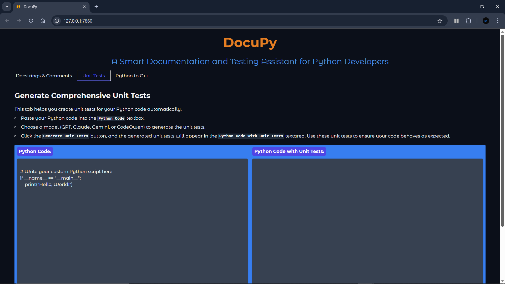</a>
<a href="DocuPy-5.png">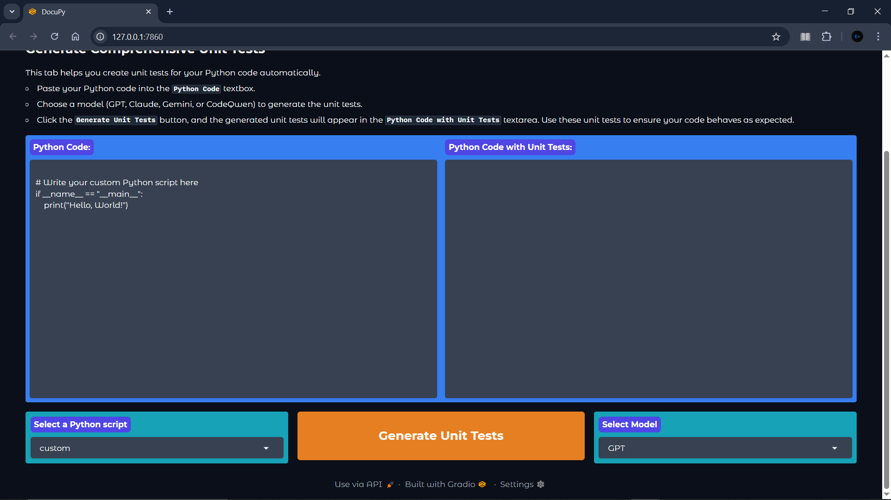</a>
<a href="DocuPy-6.png">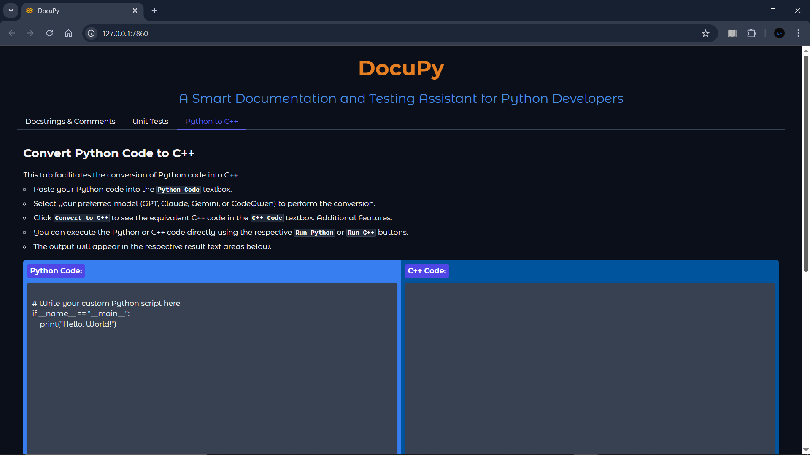</a>
<a href="DocuPy-7.png">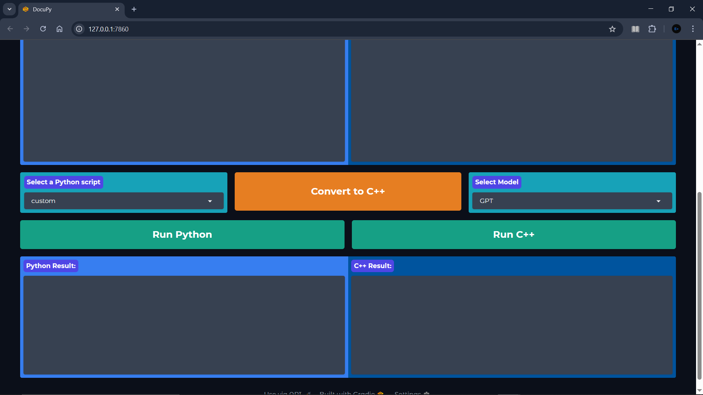</a>
<a href="DocuPy-8.png">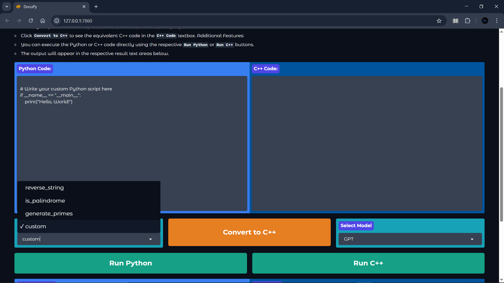</a>
<a href="DocuPy-9.png">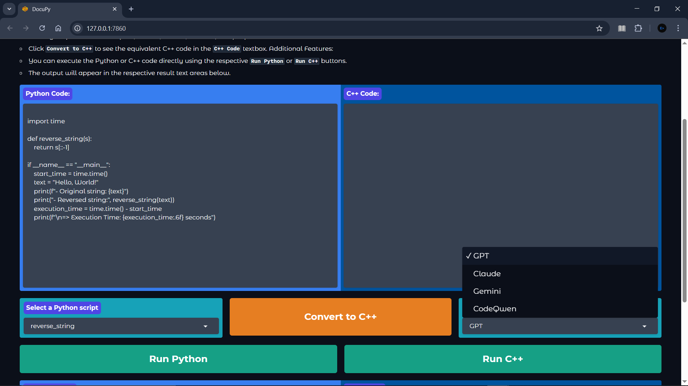</a>
<a href="DocuPy-10.png">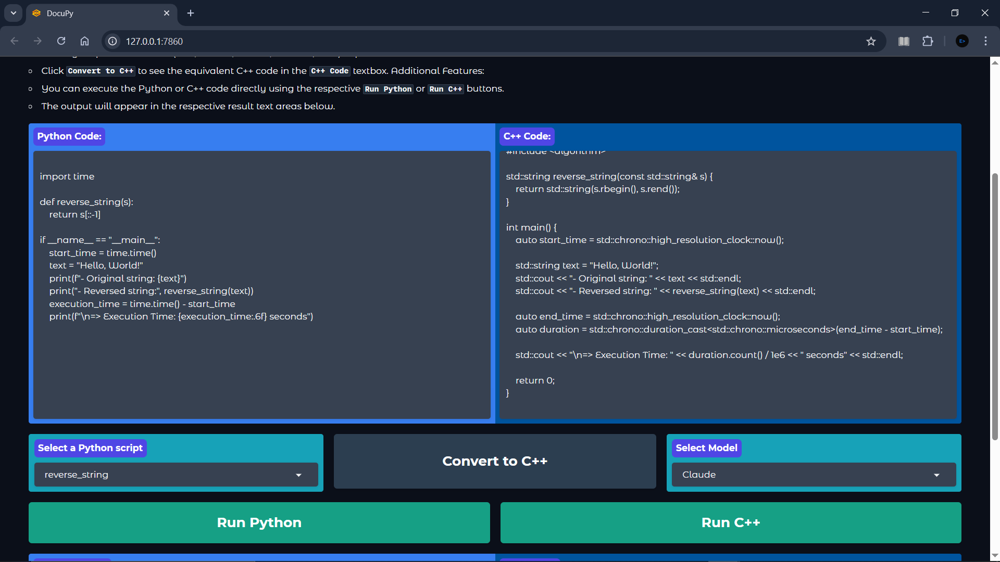</a>
<a href="DocuPy-11.png">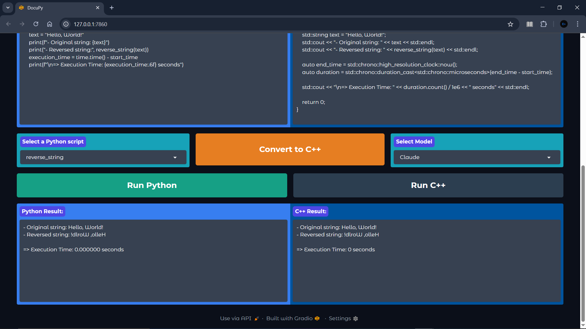</a>
<a href="DocuPy-12.png">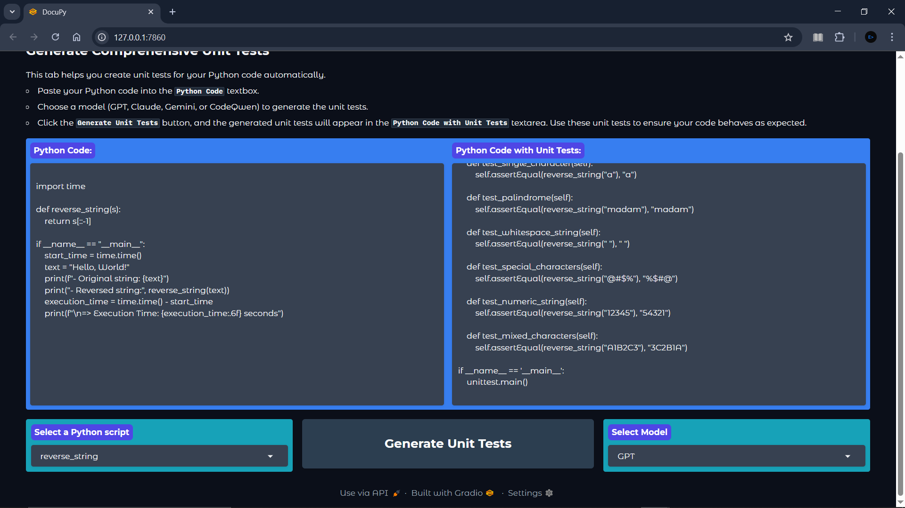</a>
<a href="DocuPy-13.png">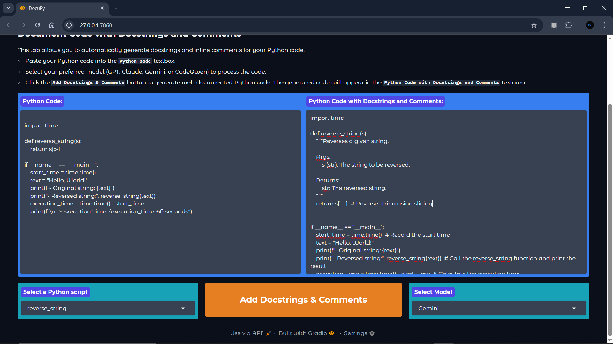</a>

---

### [🔗 View on GitHub](https://github.com/emads22/DocuPy) | [🔗 Back to Featured Projects](../../README.md#-ai-and-machine-learning)
