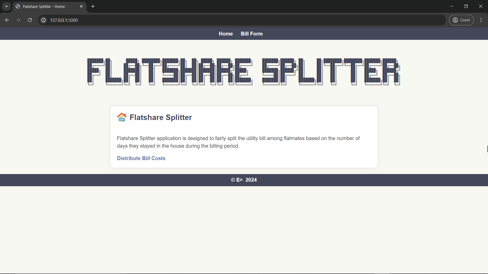
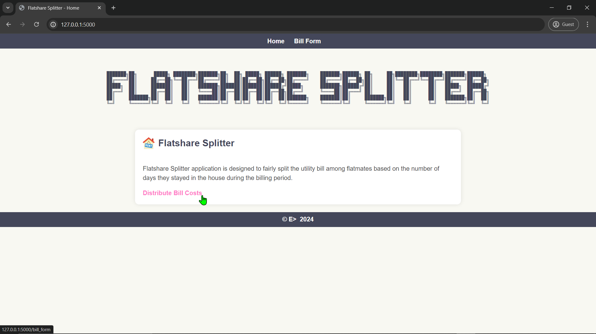
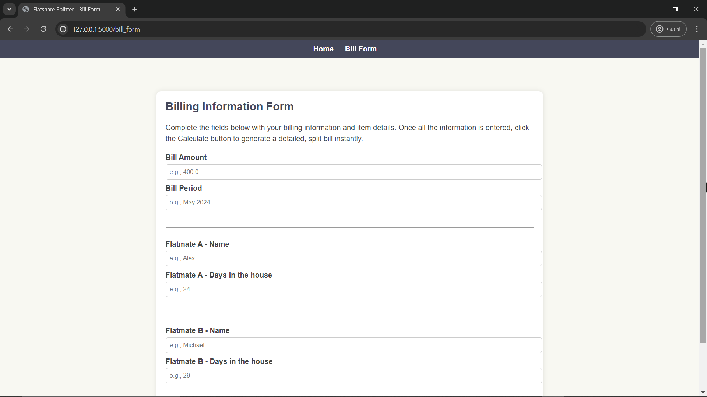
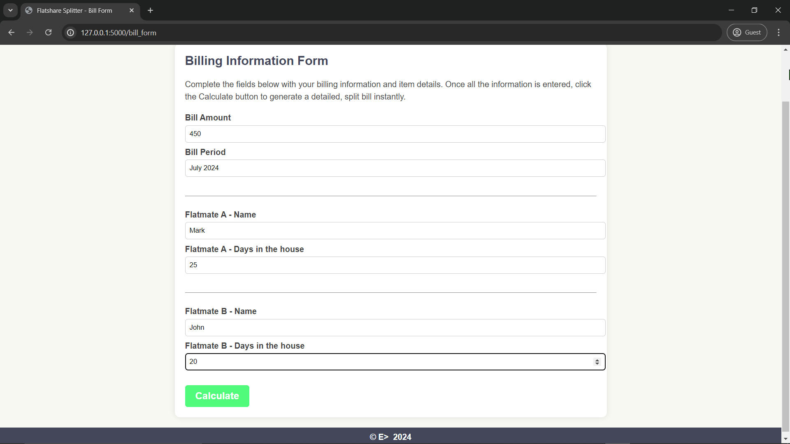
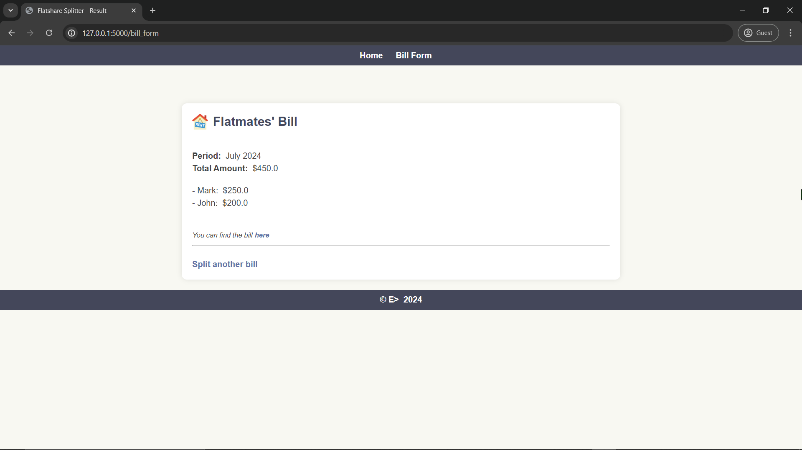
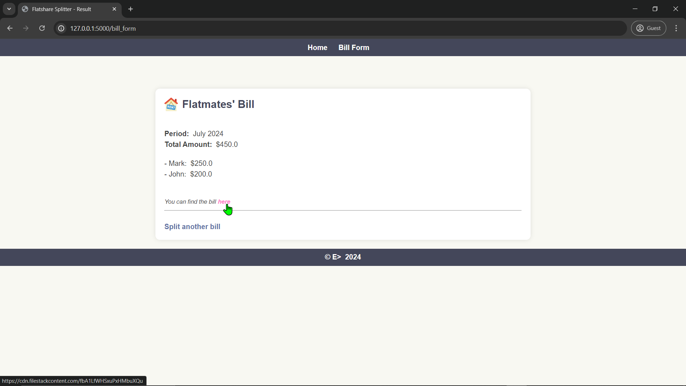
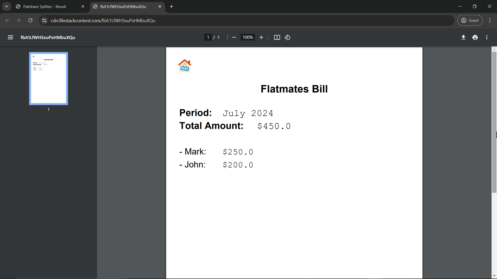
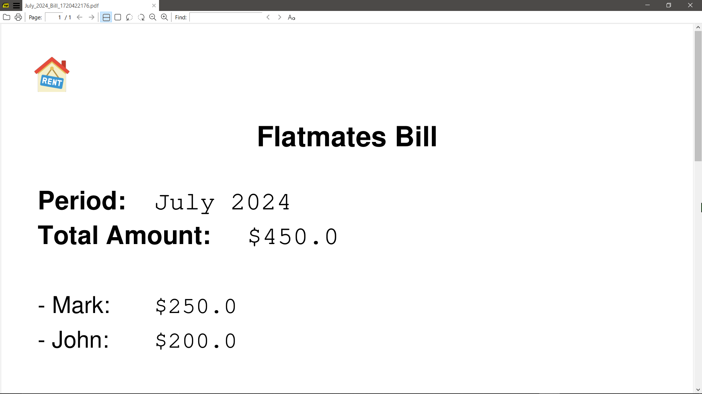

# Flatshare-Splitter-Web: Screenshots 

---

---

### [🔗 View on GitHub](https://github.com/emads22/Flatshare-Splitter-Web) | [🔗 Back to Featured Projects](../../README.md#-web-development-and-api)
