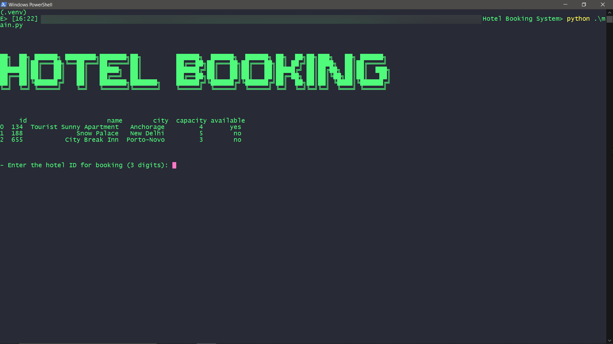
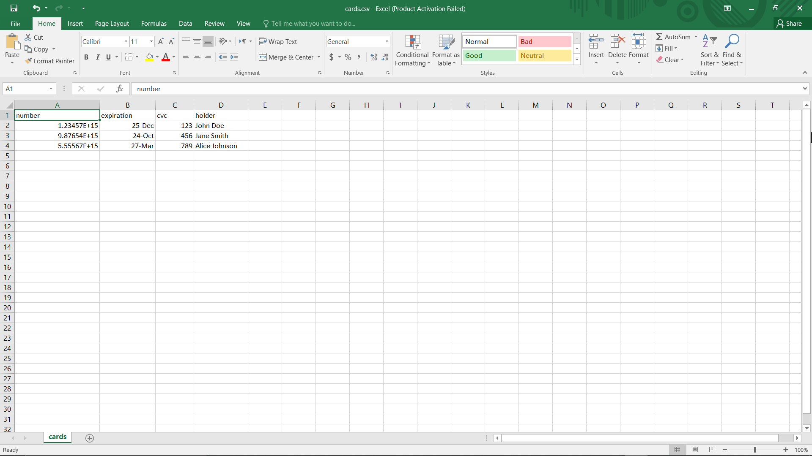
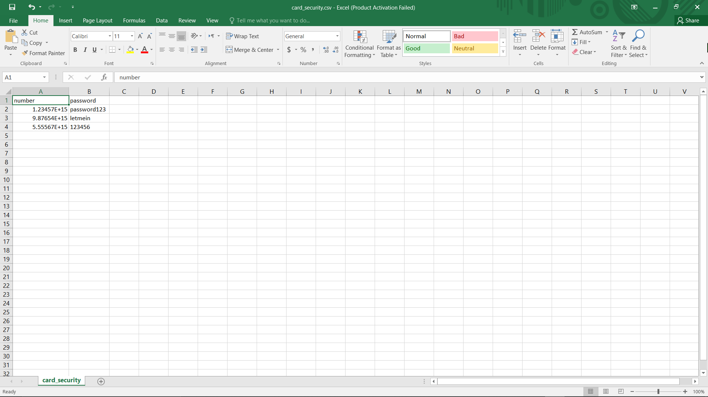
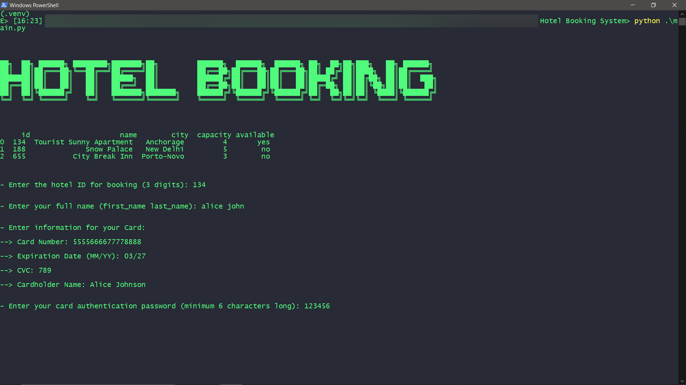
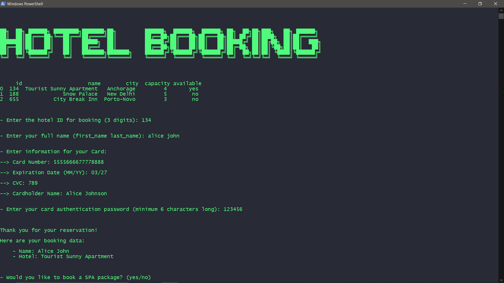
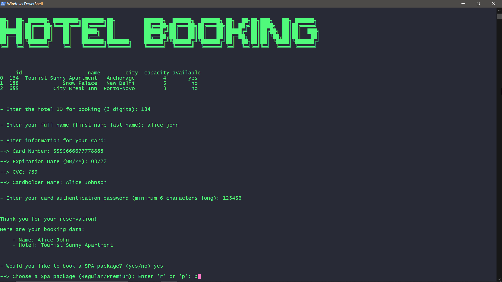
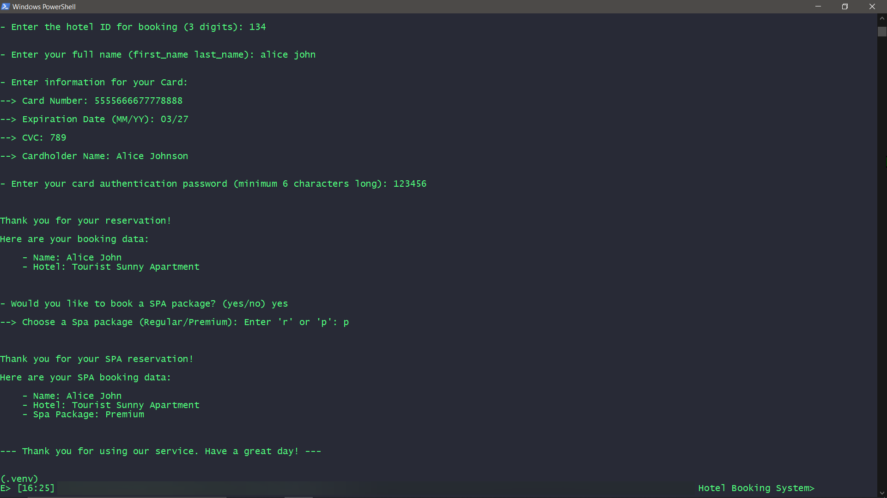
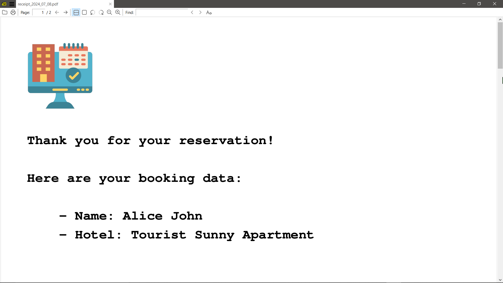
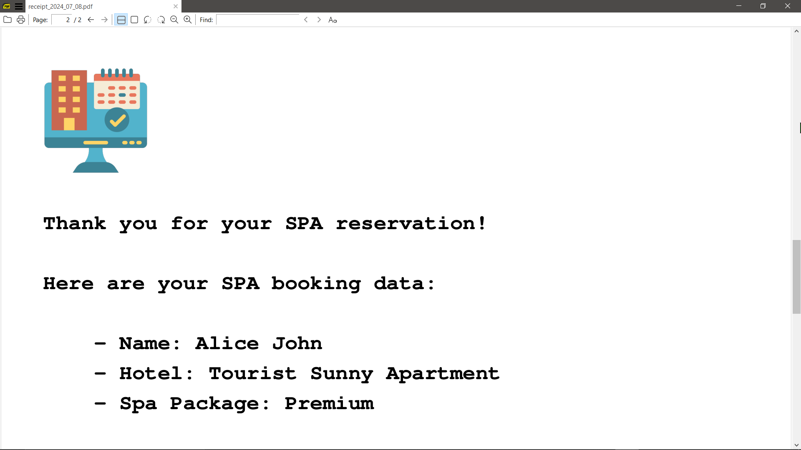
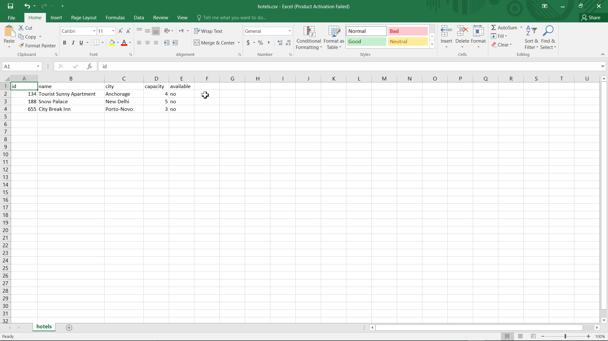

# Hotel-Booking-System: Screenshots 

---

---

### [🔗 View on GitHub](https://github.com/emads22/Hotel-Booking-System) | [🔗 Back to Featured Projects](../../README.md#-application-development)
